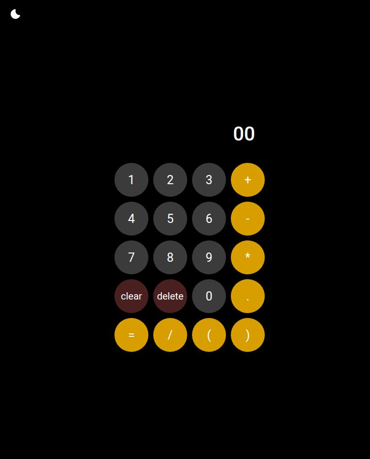

# Calculator Project

A simple calculator built with **HTML, CSS, and JavaScript**.  
Supports basic arithmetic operations, parentheses, decimals, an undo button, and dark/light mode.

## Features

- Addition, Subtraction, Multiplication, Division
- Parentheses handling
- Decimal point support
- Undo button (removes the last digit)
- Clear button
- Dark/Light mode toggle
- LocalStorage saves the current input
- Responsive design with viewport support
- Screen prevents text overflow

## File Structure

calculator/
├─ index.html
├─ scripts/
│   └─ calculator.js
└─ styles/
    └─ calculator.css

## How to Use

1. Open `index.html` in your browser
2. Click the buttons to input numbers and operations
3. Press `=` to see the result
4. Use `UNDO` to remove the last digit
5. Use `CLEAR` to reset
6. Use the **mode button** to switch between dark and light themes

## Notes

- The calculator uses `eval()` to compute the result
- Make sure to type valid expressions (matching parentheses, etc.)

## Screenshot

Screenshot of the calculator in dark mode